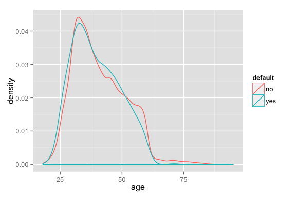
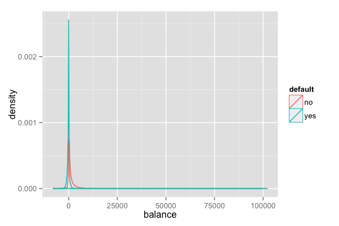
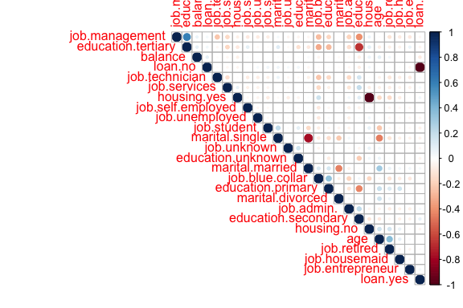
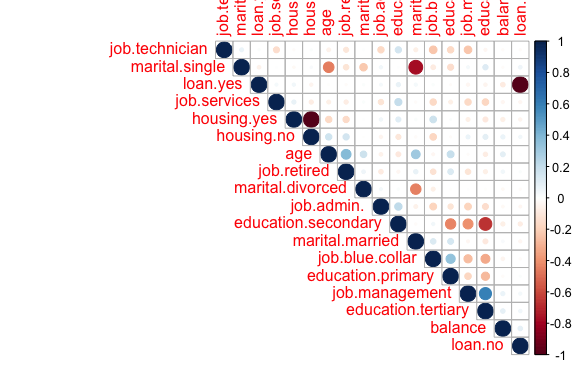
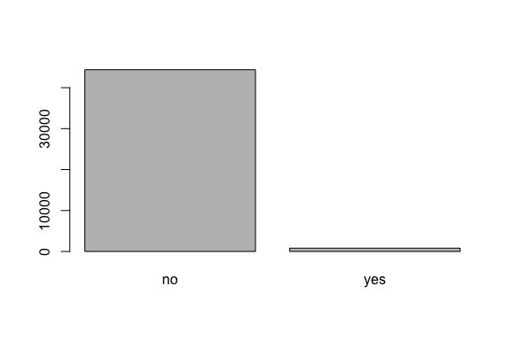
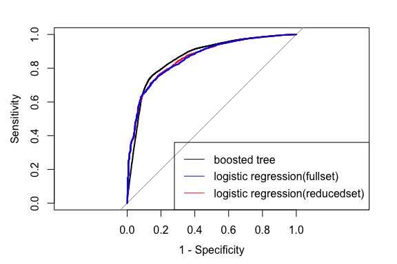

# Credit Risk Model
Shiming Zhou  
November 29, 2014  

## Executive Summary
1. **Purpose**: Use dataset(including 7 predictors) as the input variables. Built the predictive model give the probability of the default risk.
2. **Preprocessing step**: Explored the missing values; Center-scale, and boxcox the skewed numeric predictors; Created dummy variables for factor predictors; Remove redundant highly correlated variables; Remove near-zero predictors to form reducedset, but also keep the near-zero as well as the full set (can be used for differen models).
3. **Measure the performance**: Build the predictive models using all the records in the table because of the highly unbalanced default output(risk vs nonrisk), measure the performance thought the 10-fold cross validation method.
4. **Build the models**: Start building the models with Boosted tree model (least interpreta, but tend to produce most accurate results); Then apply Logistic regression, more simplistic and easy to implement (build two with fullset and reducedset).
5. **Select the model**: Compare the models performance by AUC (area under ROC curve), procesing time and interpretability, choose Logistic Regression Model(with reducedset) as the final model, and we can get the variable importance easily from the coefficients.
6. **Calculate the cut-off rate** (for default risk): by using the ROC weighted "closest.topleft" best thresholds choosing strategy. Get weight by calculating Probability Cost Function.
7. other thoughts: in the model building steps, I tried randomforest and neural network as well, however, my computer cannot handel with these two complex models. Therefore, there might other complex models can provide better AUC, but the Logistic Regression already get the similar AUC compared with boosted trees. which indicates the current model reasonably approximates the performance of the more complex methods.

## Dataset
45211 observations with 8 variables

 1. age (numeric)
 2. job : type of job (categorical: "admin.","unknown","unemployed","management","housemaid","entrepreneur","student","blue-collar","self-employed","retired","technician","services") 
 3. marital : marital status (categorical: "married","divorced","single"; note: "divorced" means divorced or widowed)
 4. education (categorical: "unknown","secondary","primary","tertiary")
 5. default: has credit in default? (binary: "yes","no")
 6. balance: average yearly balance, in euros (numeric) 
 7. housing: has housing loan? (binary: "yes","no")
 8. loan: has personal loan? (binary: "yes","no")

## Preprocess the Data
change the xlsx file to csv file to make the reading process much faster

```r
mydata <- read.csv("Jenn's test.csv", header = TRUE)
```

### Dealing with NA values

```r
library(caret)
```

```
## Loading required package: lattice
## Loading required package: ggplot2
```

```r
naTest <- apply(mydata, 2, function(x) sum(is.na(x)==TRUE))
naTest
```

```
##       age       job   marital education   default   balance   housing 
##         0         0         0         0         0         0         0 
##      loan 
##         0
```
*No missing values, cheers!*

### Plotting Numeric Predictors Density
  

*Right skewness distribution.*

### Transforming Skewed Predictors.
"BoxCox" and Standardizing to make numeric variables more normalized distribution like, "Centering" and "Scaling" to improve the numerical stability of the calculations.


```r
preObj <- preProcess(mydata1[,-3], method = c("BoxCox","center", "scale"))
trainmydata <- predict(preObj, mydata1[,-3])
mydata2 <- mydata
mydata2$age <- trainmydata$age
mydata2$balance <- trainmydata$balance
```

### Creating Dummy Variables

```r
dummies <- dummyVars(default~., data = mydata2)
mydata3 <- predict(dummies, newdata = mydata2)
mydata3 <- data.frame(mydata3)
mydata3$default <- mydata2$default
```

### remove near-zero variables
the binary nature of many predictors resulted in many cases where the data are very sparse and unbalanced.These high degree of class imbalance indicates that many of the predictors could be classified as near-zero variance predictors, which can lead to computational issues in many of the models.

```r
nzv <- nearZeroVar(mydata3, saveMetrics=TRUE)
nzv1 <- which(nzv$nzv==TRUE)
mydata4 <- mydata3[,-(nzv1)]
mydata4$default <- mydata3$default
```
- "full set" of predictors `mydata3` included all the variables regardless of their distribution. 
- "reduced set" `mydata4` was developed for models that are sensitive to sparse and unbalanced predictors

### Dealing with collinearity problem

Visualize the correlation plots

  

a high-correlations filter was used on the predictors set to remove these highly redundant predictors from both datasets


```r
fullCovMat <- cov(mydata3[,-26])
library(subselect)
fullResults <- trim.matrix(fullCovMat)
discardName1 <- fullResults$names.discarded
discardName1
```

```
## [1] "job.unknown"       "marital.divorced"  "education.unknown"
## [4] "housing.yes"       "loan.yes"
```

```r
reducedCovMat <- cov(mydata4[,-19])
reducedResults <- trim.matrix(reducedCovMat)
discardName2 <- reducedResults$names.discarded
discardName2
```

```
## [1] "marital.divorced" "housing.yes"      "loan.no"
```

```r
mydata3 <- mydata3[,-(fullResults$numbers.discarded)]
mydata4 <- mydata4[,-(reducedResults$numbers.discarded)]
```

## Build Predictive Models
- Start building the models that are the least interpretable and most flexible, they tend to have a high likelihood of producing the empirically optimum results. Here I choose to start with Boosted tree model.
- Then I choose Logistic regression, which is a more simplistic technique for estimating a classification boundary. It has no tuning parameters and its prediction equation is simple and easy to implement using most software (build two with fullset and reducedset)
- Then compare the models performance though AUC (area under ROC curve) and the procesing time to choose the final model

 

the barplot shows the unbalanced number of observations in credit risk vs non-credit risk people. Therefore, We will use all the observations to create our predictive model and measure the performance using cross validation resampling strategies. 

the frequency of "no" is 0.982

### Parallel processing 

Use doSNOW for doing parallel processing

```r
library(doSNOW)
```

```
## Loading required package: foreach
## Loading required package: iterators
## Loading required package: snow
```

```r
registerDoSNOW(makeCluster(2, type = "SOCK"))
```

### Set trainControl parameters

We will use 10-fold cross validation to evaluate the models and select to parameters(for some models)

```r
ctrl <- trainControl(method="cv", summaryFunction = twoClassSummary,classProbs=TRUE, savePredictions =TRUE)
```

### Model1:Boosted Tree Model

```r
library(pROC)
```

```
## Type 'citation("pROC")' for a citation.
## 
## Attaching package: 'pROC'
## 
## The following objects are masked from 'package:stats':
## 
##     cov, smooth, var
```

```r
library(gbm)
```

```
## Loading required package: survival
## Loading required package: splines
## 
## Attaching package: 'survival'
## 
## The following object is masked from 'package:caret':
## 
##     cluster
## 
## Loading required package: parallel
## 
## Attaching package: 'parallel'
## 
## The following objects are masked from 'package:snow':
## 
##     clusterApply, clusterApplyLB, clusterCall, clusterEvalQ,
##     clusterExport, clusterMap, clusterSplit, makeCluster,
##     parApply, parCapply, parLapply, parRapply, parSapply,
##     splitIndices, stopCluster
## 
## Loaded gbm 2.1
```

```r
library(plyr)
set.seed(4321)
t1 <- Sys.time()
mod1 <- train(default~., data = mydata, method = "gbm",metric = "ROC",trControl = ctrl, verbose=FALSE)
t2 <- Sys.time()
tmod1 <- difftime(t2,t1)
mod1
```

```
## Stochastic Gradient Boosting 
## 
## 45211 samples
##     7 predictor
##     2 classes: 'no', 'yes' 
## 
## No pre-processing
## Resampling: Cross-Validated (10 fold) 
## 
## Summary of sample sizes: 40689, 40690, 40691, 40690, 40690, 40691, ... 
## 
## Resampling results across tuning parameters:
## 
##   interaction.depth  n.trees  ROC  Sens  Spec   ROC SD  Sens SD  Spec SD
##   1                   50      0.9  1     0.000  0.02    1e-04    0.000  
##   1                  100      0.9  1     0.001  0.02    2e-04    0.004  
##   1                  150      0.9  1     0.002  0.02    2e-04    0.005  
##   2                   50      0.9  1     0.002  0.02    2e-04    0.005  
##   2                  100      0.9  1     0.010  0.02    2e-04    0.010  
##   2                  150      0.9  1     0.012  0.02    2e-04    0.008  
##   3                   50      0.9  1     0.006  0.02    2e-04    0.009  
##   3                  100      0.9  1     0.012  0.02    2e-04    0.013  
##   3                  150      0.9  1     0.016  0.02    3e-04    0.019  
## 
## Tuning parameter 'shrinkage' was held constant at a value of 0.1
## ROC was used to select the optimal model using  the largest value.
## The final values used for the model were n.trees = 150,
##  interaction.depth = 3 and shrinkage = 0.1.
```

```r
tmod1
```

```
## Time difference of 1.835 mins
```

### Model2: Logistic Regression with fullset

```r
set.seed(4321)
t3 <- Sys.time()
mod2 <- train(default~., data = mydata3, method = "glm", metric="ROC",trControl = ctrl)
```

```
## Warning: glm.fit: fitted probabilities numerically 0 or 1 occurred
```

```r
t4 <- Sys.time()
tmod2 <- difftime(t4,t3)
mod2
```

```
## Generalized Linear Model 
## 
## 45211 samples
##    20 predictor
##     2 classes: 'no', 'yes' 
## 
## No pre-processing
## Resampling: Cross-Validated (10 fold) 
## 
## Summary of sample sizes: 40689, 40690, 40691, 40690, 40690, 40691, ... 
## 
## Resampling results
## 
##   ROC  Sens  Spec  ROC SD  Sens SD  Spec SD
##   0.9  1     0.02  0.02    4e-04    0.02   
## 
## 
```

```r
tmod2
```

```
## Time difference of 24.63 secs
```

### Model3: Logistic Regression with reducedSet

```r
set.seed(4321)
t5 <- Sys.time()
mod3 <- train(default~., data = mydata4, method = "glm", metric="ROC",trControl = ctrl)
```

```
## Warning: glm.fit: fitted probabilities numerically 0 or 1 occurred
```

```r
t6 <- Sys.time()
tmod3 <- difftime(t6,t5)
mod3
```

```
## Generalized Linear Model 
## 
## 45211 samples
##    15 predictor
##     2 classes: 'no', 'yes' 
## 
## No pre-processing
## Resampling: Cross-Validated (10 fold) 
## 
## Summary of sample sizes: 40689, 40690, 40691, 40690, 40690, 40691, ... 
## 
## Resampling results
## 
##   ROC  Sens  Spec  ROC SD  Sens SD  Spec SD
##   0.9  1     0.02  0.02    4e-04    0.02   
## 
## 
```

```r
tmod3
```

```
## Time difference of 18.25 secs
```


## Measure and Select the Model

### Measure the performance by AUC (ROC) and processing Time (with cross validation)

- For this credit risk model, accuracy is not the primary goal, ROC curve can be used for a quantitative assesment of the model. The model with the largest area under ROC curve would be the most effective. 
- Because the severe Class imbalance exists, we can use ROC curve to choose a threshold that appropriately maximizes the trade-off between sensitivity and specificity or find the particular target points on the ROC curve. we can use the ROC curve to determine the alternate cutoffs for the class probabilities. 
- The performance is estimated through 10-fold cross validation


```
## 
## Call:
## roc.default(response = mod1$pred$obs, predictor = mod1$pred$no,     levels = rev(levels(mod1$pred$obs)))
## 
## Data: mod1$pred$no in 7335 controls (mod1$pred$obs yes) < 399564 cases (mod1$pred$obs no).
## Area under the curve: 0.866
```

 

### Selecting Model
- ROC plot shows the boosted tree model provide largest AUC, but just a little higher than the logistic regression model. However the processing time is around 6 times than the logistic regression model with reducedset. And Logistic Regression is much easier to interpret.
- Two logistic regression models have no significant difference in AUC, so we choose the one with reducedset because of the less time required mod3. Below is our final model. We can get the variable importance from the coeffieienct.

**Final Model**

```
## 
## Call:  NULL
## 
## Coefficients:
##         (Intercept)                  age           job.admin.  
##             -6.1973              -0.1013              -0.6756  
##     job.blue.collar       job.management          job.retired  
##             -0.1975              -0.0742              -0.4470  
##        job.services       job.technician      marital.married  
##             -0.5252              -0.4750              -0.3710  
##      marital.single    education.primary  education.secondary  
##             -0.1810              -0.0866              -0.0519  
##  education.tertiary              balance           housing.no  
##             -0.4233              -6.8706               0.4316  
##            loan.yes  
##              0.7240  
## 
## Degrees of Freedom: 45210 Total (i.e. Null);  45195 Residual
## Null Deviance:	    8160 
## Residual Deviance: 6690 	AIC: 6720
```

## Determine the profit-risk control cutoff rate.

We want to reduce the cost associate with the fraudulent transactions. Here, the event of interest is no fraud, The False Positive and False Negative results will cause a loss of money. True Positive results will bring the income.

Assuming average requested loan for a person is $4000, and interest rate is 20%
We make the assumption that the cost are only calculated for the first year
- False Positive Cost: $4000
- False Negative Cost: $4000*.2

### Calculate Probability Cost Function
pcf is the proportion of the total cost associated with a false-positive sample.

```r
fpc <- 4000
fnc <- 4000*.2
pcf <- (freq*fpc)/((freq*fnc)+((1-freq)*fpc))
costWeight <- 1/pcf
```
costWeight is the cost associated with the falso-negative sample

### Get cutoff by using "closest.topleft" strategy

Adjusting the Cost weights and get ROC cutoff

```r
library(pROC)
```

```
## Type 'citation("pROC")' for a citation.
## 
## Attaching package: 'pROC'
## 
## The following objects are masked from 'package:stats':
## 
##     cov, smooth, var
```

```r
cutoff <- coords(mod3Roc, "b", ret=c("threshold", "specificity", "sensitivity"), best.method="closest.topleft", best.weights=c(costWeight, freq))
cutoff
```

```
##   threshold specificity sensitivity 
##      0.9593      0.5448      0.9135
```

```r
cutoffRisk <- 1- cutoff[1]
cutoffRisk
```

```
## threshold 
##   0.04065
```
*Therefore, with this logistic regression model,  0.0407 is the suggesed default risk to provide decision support on profit-risk control.*

## Predicte Result
Here shows the top 10 lines of the new dataset with probability filled in. 

```r
mydata5 <- predict(mod3, newdata = mydata4, type = "prob")
mydata$risk <- mydata5$yes
head(mydata)
```

```
##   age          job marital education default balance housing loan
## 1  58   management married  tertiary      no    2143     yes   no
## 2  44   technician  single secondary      no      29     yes   no
## 3  33 entrepreneur married secondary      no       2     yes  yes
## 4  47  blue-collar married   unknown      no    1506     yes   no
## 5  33      unknown  single   unknown      no       1      no   no
## 6  35   management married  tertiary      no     231     yes   no
##        risk
## 1 0.0001260
## 2 0.0191078
## 3 0.0598666
## 4 0.0007779
## 5 0.0572081
## 6 0.0113884
```
